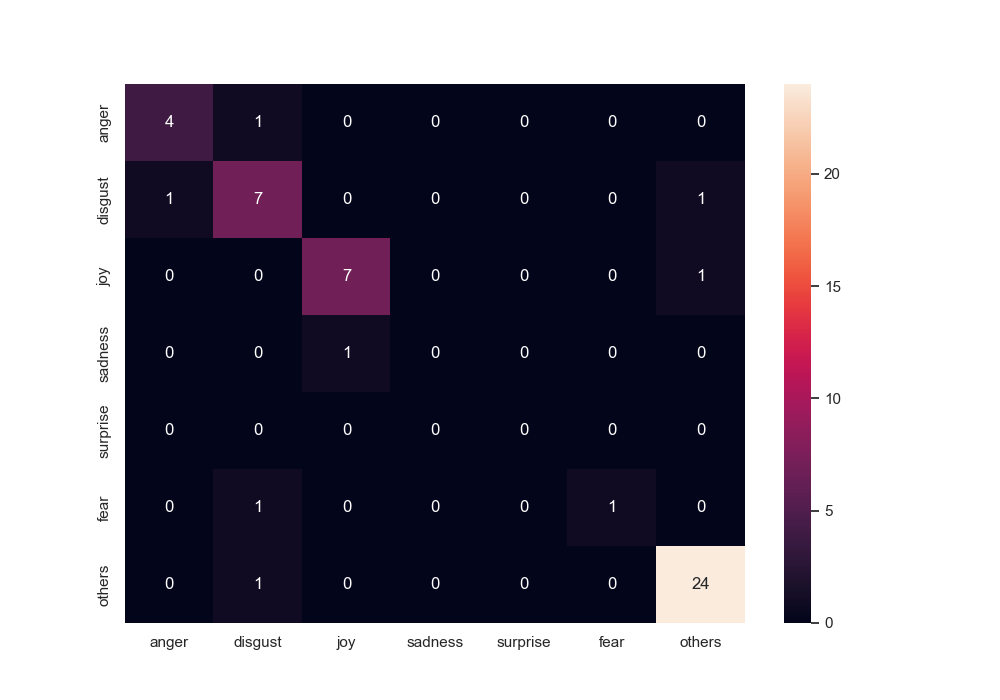

# Emotions of the political debate on Twitter in the context of the 2020 US presidential election
#### Based on most-liked political tweets during the US elections in 2020, are the emotions in the debate more positive or negative in swing states than safe states?

Emotion analysis is the use of natural language processing, computational linguistics and text analysis 
to study, identify or quantify subjective information or emotional states and moods. 
In this research, the goal is to identify emotional states positive and negatively between different 
political states within the US during the 2020 elections on Twitter and to include a method to 
understand which topics are mentioned. Conducting such research contributes to a better understanding 
and overview of the political climate on a social media platform as Twitter. The model used within 
this research is a toolkit called Pysentimiento [1] that is based on the Transformers library. 
Furthermore, an analysis on distinctive words has been conducted. The results of this study revealed 
that the dissimilarity between the distributions of emotion intensities and their frequencies occurs 
at a different level than the one initially assumed. These are similar for Democrat and swing states 
groups, which differ from Republican states. The most distinctive words analysis allowed for 
identifying the objects of political debate in the context of a particular emotion for each group of 
states. It was found that most of the tweets with dominantly negative emotions focused on the former 
US President, counting mailed ballots and changing states 'flipping' their political preference. 
The contents related to the issues related to the political debate and the state of democracy were 
also identified as distinctive for sad and fearful tweets. The most distinctive words of joyful, 
surprised and neutral tweets did not allow for extracting meaningful insights.    
More details on the analysis can be found in the PDF paper included in this repository.

### Data
The dataset used for this study was derived from the dataset available on Kaggle - US Election 2020 Tweets [2].
In this repository, only the pre-processed dataset is available.

### Analysis

For the purpose of the analysis, not only the tweets' content was studied, but also the state in which the user posting it was registered.
Therefore, based on user's location, the assumption of political affiliation of the state was made (dominantly Democrat/Republican or swing).
The content of the tweet was studied in terms of emotions (their intensities as well as the frequencies of dominant emotions) and objects of these emotions (most distinctive words) in a state-wise manner.   

#### Data Wrangling
The Jupyter notebook file *Data Cleaning and Descriptives.ipynb* was used for the exploratory step of the analysis.
The dataset was imbalanced, thus 10000 most-liked tweets for each state were used as the target dataset.    

#### Data pre-processing
The directory *pre processing* contains notebooks in which the methods for data pre-processing were used in this study.
To pre-process the data, first and foremost, URLs and HTML tags were removed as these do not contain any information that could give an indication on a Twitterer's emotional state. From there on, the data was pre-processed two different ways in order to fit the task of finding the most distinctive words and to fit the emotion analysis model Pysentimiento. The data was not split, the 30000 tweets were the test sample.

#### Emotions analysis - emotions intensities and frequencies of dominant emotions
The module *extractEmotions.py* allows for performing emotion classification using Pysentimiento's 
library. The predictions which were evaluated qualitatively on 50 randomly selected tweets, achieved accuracy of 86%.
The technique of this performance measure was based on penalizing the model in case neither the emotion label with the highest probability,
nor the emotion label with the second-highest probability assigned by the model corresponded to the emotion label assigned by human. The results of model performance's evaluation are available in *performance_metrics* folder.    
  
A seperate source file *measurePerformance.py* is responsible for generating outputs related to the used model's performance.  
The module also assigns emotion intensity scores to the tweets and saves the modified 
dataframe to CSV file. The module relies heavily on the pre-processing techniques introduced before.  
Then, the file *emotionsAnalysis.ipynb* allows for studying the emotions' frequency distribution in a state-wise manner, as well as emotion intensities distribution.
The outputs are directed to *emotions__reports_plots* folder - both text reports and plots are included.  
 
Example of the intensities distribution for different groups of states:  

#### Emotions analysis - Most distinctive words
The notebook *dist_features_of_emotions_pre_results.ipynb* was used for analysing the discussions objects in a state-wise and emotion-wise manner.
The analysis employed most distinctive words method. It was chosen, because it allows for doing a multiple comparison between specific groups, e.g. tweets with dominant emotion of anger from blue states versus red and swing state and returns tokens that have significantly higher frequency in the target corpus, compared to a reference corpus [3].
Using this technique, the distinctive keywords were found in the context of a particular emotion.    

#### References
[1] PÃÅerez, J., M., Giudici, J., C. & Luque, F. (2021). pysentimiento: A Python Toolkit for Sentiment Analysis and Social NLP tasks. Retrieved from https://arxiv.org/pdf/2106.09462.pdf  
[2] Hui, M. (2020). US Election 2020 Tweets. Retrieved from https://www.kaggle.com/manchunhui/us-election-2020-tweets  
[3] Pojanapunya, P. & Todd, R., W. (2018). Log-likelihood and odds ratio: Keyness statistics for different purposes of keyword analysis. Corpus Linguistics and Linguistic Theory 1(14), 133-167. https://doi.org/10.1515/cllt-2015-0030
